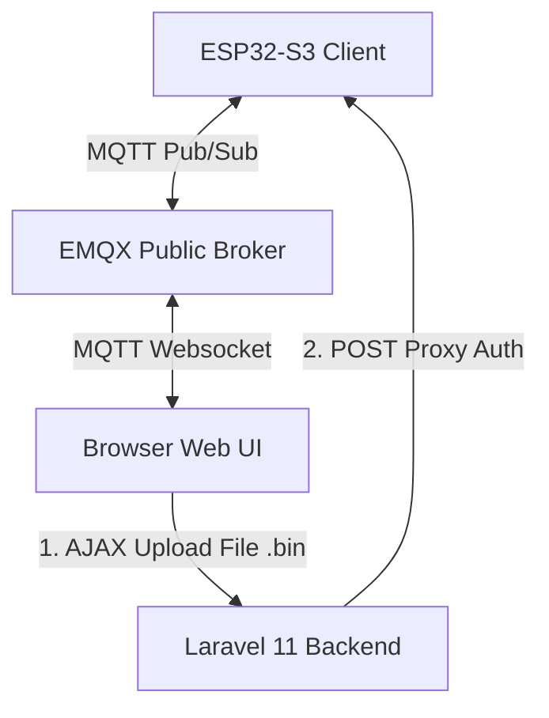

# IoT Monitoring & Control Dashboard: ESP32-S3 (Sparkle IoT) + Laravel 11

Aplikasi ini adalah dashboard IoT terintegrasi untuk memonitor data sensor, mengontrol LED RGB, mengirimkan command kustom, dan melakukan pembaruan firmware (OTA) secara real-time pada board **Sparkle IoT XH-S3E (ESP32-S3)** menggunakan broker **MQTT (EMQX)** dan framework **Laravel 11**.

---

## 🌟 Fitur Utama

1. **Real-time Sensor Monitoring:** Memantau suhu & kelembaban ruangan (DHT11) serta jarak (Ultrasonic HC-SR04) setiap 2 detik.
2. **Onboard Telemetry:** Statistik kesehatan ESP32-S3 (Free Heap, Total Heap, Uptime, Suhu Core CPU, WiFi RSSI).
3. **RGB LED Controller:** Palet warna visual interaktif untuk menyetel warna LED RGB bawaan Sparkle IoT (WS2812B) secara real-time tanpa konflik interupsi jaringan.
4. **Interactive Command Console:** Terminal interaktif untuk mengirimkan command kustom (`ping`, `reboot`, `led_off`) dengan respon langsung.
5. **Logs Terminal & Auto-Scroll:** Terminal log debug MQTT interaktif dengan batas tinggi maksimal (`h-64` scrollable) dan kendali **Auto-Scroll ON/OFF**.
6. **Local Web OTA (Over-The-Air) Update:** Sistem upgrade firmware asinkron (AJAX) di halaman utama (tanpa berpindah tab baru) yang dilengkapi **Dual-Phase Fallback Verification** untuk bypass bug memori otentikasi di ESP32.

---

## 🏗️ Arsitektur Sistem



---

## 📂 Struktur Folder Proyek

```
ESP32-MQTT/
├── app/                        # Logika Inti Laravel
├── config/
│   └── services.php            # Binding konfigurasi kredensial default OTA
├── esp32_mqtt/                 # Kode Firmware ESP32 (Standard)
│   ├── build/                  # [DIABAIKAN] Direktori output kompilasi Arduino IDE
│   ├── config.h                # [DIABAIKAN] Kredensial WiFi & OTA privat Anda
│   ├── config.h.example        # Template konfigurasi kredensial (Git Safe)
│   └── esp32_mqtt.ino          # Logika firmware utama ESP32-S3
├── resources/
│   ├── js/
│   │   └── app.js              # Logika frontend (MQTT Client, AJAX OTA, Auto-Scroll)
│   └── views/
│       └── welcome.blade.php   # Dashboard User Interface (Tailwind CSS)
├── routes/
│   └── web.php                 # Route proxy server-side untuk upload OTA
├── .env                        # Variabel environment Laravel (disamarkan)
├── .gitignore                  # Konfigurasi pengabaian file Git
└── README.md                   # Dokumen panduan ini
```

---

## 🔒 Pengamanan Variabel Sensitif (SSID WiFi, Password, & Kredensial OTA)

Proyek ini dirancang agar kredensial privat Anda aman dari pelacakan Git (tidak akan terunggah ke repositori publik):

### 1. Sisi ESP32 (Firmware)
Kredensial disimpan secara terpisah di file [config.h](file:///D:/ABIN/ESP32-MQTT/esp32_mqtt/config.h) yang telah didaftarkan ke `.gitignore`. 
* Gunakan file [config.h.example](file:///D:/ABIN/ESP32-MQTT/esp32_mqtt/config.h.example) sebagai template:
  ```cpp
  #ifndef CONFIG_H
  #define CONFIG_H
  const char* ssid = "SSID_WIFI_ANDA";
  const char* password = "PASSWORD_WIFI_ANDA";
  const char* host = "esp32-webupdate";
  const char* authUser = "USERNAME_OTA_ANDA";
  const char* authPass = "PASSWORD_OTA_ANDA";
  #endif
  ```

### 2. Sisi Laravel (Web)
Kredensial default dashboard dipindahkan ke file `.env` Laravel dan dimuat secara dinamis via `config/services.php`:
* **Di file `.env`:**
  ```env
  OTA_DEFAULT_USERNAME=cth-user
  OTA_DEFAULT_PASSWORD=cth-pass
  ```
* **Di file Blade / Controller:** Diakses menggunakan sintaks Laravel:
  `config('services.ota.username')` dan `config('services.ota.password')`.

---

## ⚙️ Cara Kerja Sistem Web OTA (AJAX Proxying)

Ketika Anda melakukan update firmware melalui dashboard web:
1. **Bypass CORS:** Browser tidak diizinkan melakukan POST request langsung ke IP lokal ESP32 karena kebijakan keamanan *Cross-Origin Resource Sharing (CORS)*. Untuk itu, browser mengirimkan file `.bin` ke server Laravel terlebih dahulu via route `/ota-proxy`.
2. **Server-to-Server Proxy:** Server Laravel bertindak sebagai jembatan yang mengirimkan ulang file tersebut langsung ke IP ESP32 dengan melampirkan header basic authentication: `Authorization: Basic <base64>`.
3. **Dual-Phase Fallback Verification:** 
   * Pada ESP32, saat request masuk (`UPLOAD_FILE_START`), server memvalidasi kredensial.
   * Karena bug library `WebServer` bawaan ESP32 sering mereset status variabel penanda otentikasi di tengah-tengah transfer data, program kita menerapkan **otentikasi fase kedua** langsung di akhir request callback POST (`HTTP_POST`). Jika otentikasi ter-reset, program akan menarik ulang header di memori untuk mengesahkan request kembali sehingga terhindar dari error **401 Unauthorized**.

---

## 🚀 Panduan Memulai

### Prasyarat
* PHP >= 8.2 & Composer
* Node.js & NPM
* Arduino IDE (untuk flashing ESP32)

### 1. Setup Backend Laravel
1. Clone repositori ke folder lokal Anda.
2. Buat duplikat file `.env.example` menjadi `.env`.
3. Jalankan perintah instalasi dependency:
   ```bash
   composer install
   npm install
   ```
4. Generate key aplikasi dan jalankan dev server Laravel:
   ```bash
   php artisan key:generate
   php artisan serve
   ```
5. Di terminal lain, lakukan kompilasi aset frontend:
   ```bash
   npm run dev  # (atau npm run build untuk produksi)
   ```

### 2. Setup Firmware ESP32
1. Buka folder `esp32_mqtt/` menggunakan Arduino IDE.
2. Buat salinan file `config.h.example` lalu beri nama `config.h`.
3. Buka file `config.h` dan isi dengan detail WiFi serta kredensial OTA Anda.
4. Hubungkan board Sparkle IoT XH-S3E ke port USB komputer Anda.
5. Pada Arduino IDE, pilih board **ESP32S3 Dev Module** dan upload programnya.
6. Pantau Serial Monitor (baud rate **115200**) untuk memastikan ESP32 terhubung ke WiFi dan broker MQTT EMQX.

### 3. Pengujian Dashboard
1. Buka browser dan arahkan ke alamat `http://localhost:8000`.
2. Setelah ESP32 online, dashboard akan menampilkan status **ONLINE** berwarna hijau dan grafik sensor akan bergerak dinamis.
3. Anda bisa mengetes menggeser panel warna LED RGB untuk melihat warna LED onboard menyala secara real-time.
4. Untuk memperbarui firmware secara OTA, export file `.bin` Anda dari Arduino IDE (Menu *Sketch* -> *Export Compiled Binary*), masukkan file tersebut pada kartu **Firmware Update (Web OTA)** di dashboard web, lalu klik **UPLOAD FIRMWARE**.

---

Dibuat dengan ❤️ untuk kemudahan pengembangan perangkat berbasis ESP32 dan Laravel.
